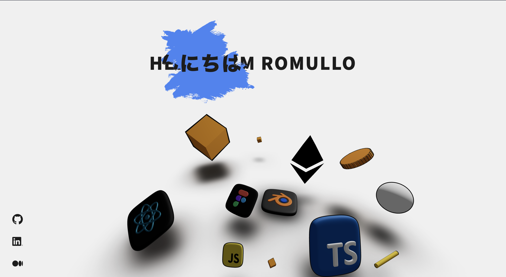

# My personal portfolio. WIP! Not done yet. But it's getting pretty cool. 
  ---
### Current deploy here: https://romullo-portfolio.vercel.app/
  ---
<h3>Technologies used:</h3>
<ul>
  <li>NextJs</li>
  <li>Typescript</li>
  <li>Styled-Components</li>
  <li>React Three Fiber</li>
  <li>Framer-Motion</li>
  <li>Amazing original components 😜</li>
  <li>More to come...</li>
</ul>

 

  ---

<h3>Instructions</h3>

  To run the project, just install de dependencies and type 'yarn dev', just like any project in NextJs.

Please feel free to take a look at the code, fork it, steal it, whatever. 
